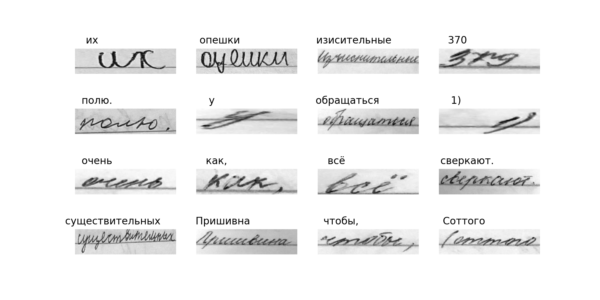

# russian-handwritten-text-recognition
The project of creating neural network possible to recognise Russian cursive handwritten text




## Requirements
tensorflow >=2.5.0

## Dataset
Model was trained using dataset from National Technological Olympiad in artificial intelligence and Hackaton in OCR held by Academy of artificial intelligence.

## Usage

Don't forget to install tensorflow!

You need to download best-model.h5 and predict.py. 
Replace path_to_images variable with path to the images. 
```
path_to_images = "your path here"
```

Your also have to remember that best-model.h5 should be in the same directory otherwise change  the path here:
```
model.load_weights("best-model.h5")
```

## Results

I got CER - 0.0194 and CTC loss - 1.6510

This is good result but it is still not perfect so be careful to use it

This model is able to recognise the following characters:


!, ", %, "", (, ), *, +, ,, -, ., /, 0, 1, 2, 3, 4, 5, 6, 7, 8, 9, :, ;, <, =, >, ?, A, B, C, D, E, F, G, H, I, J, K, L, M, N, O, P, R, S, T, U, V, W, X, Y, [, ], _, a, b, c, d, e, f, g, h, i, j, k, l, m, n, o, p, q, r, s, t, u, v, w, x, y, z, |, }, Ё, А, Б, В, Г, Д, Е, Ж, З, И, К, Л, М, Н, О, П, Р, С, Т, У, Ф, Х, Ц, Ч, Ш, Щ, Ы, Ь, Э, Ю, Я, а, б, в, г, д, е, ж, з, и, й, к, л, м, н, о, п, р, с, т, у, ф, х, ц, ч, ш, щ, ъ, ы, ь, э, ю, я, ё, №


